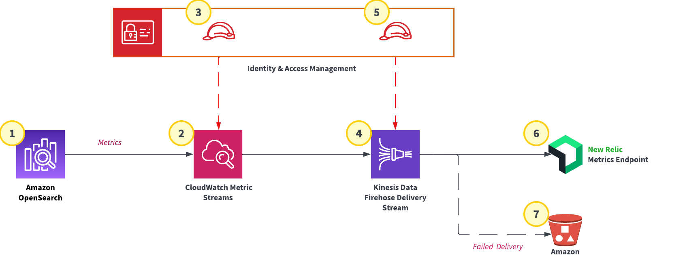

# AWS-Managed Services Metric Collection

This module's purpose is to streamline the implementation of a metric delivery pipeline to support observability of AWS Managed Services that publish metric data to Amazon CloudWatch. The destination of the metric data collected is New Relic, FNL/CTOS' preferred metric observability platform. 

## Resources Provided by the Module

  - Amazon CloudWatch Metric Stream
  - AWS Kinesis Data Firehose Delivery Stream
  - Amazon Identity and Access Management Roles

## Resources Not Provided by the Module

  - Amazon Simple Storage Solution (S3 Bucket)
  - Metric Data Producers

## Solution Overview

## Usage Example (in progress)
<pre><code>module "new_relic_metric_pipeline" {
  source = "github.com//CBIIT/datacommons-devops/terraform/modules/firehose-metrics/"

  account_id               = data.aws_caller_identity.current.account_id
  app                      = "icdc"
  external_id              = "1234567890"
  http_endpoint_access_key = "KL3SDFJ6VX53QOROERTIBMCLPI2R39_"
  level                    = "non-prod"
  program                  = "crdc"
  s3_bucket_arn            = "arn:aws:s3:::example-destination-bucket"
}</code></pre>

<!-- BEGIN_TF_DOCS -->
## Requirements

No requirements.

## Providers

| Name | Version |
|------|---------|
|  [aws](#provider\_aws) | n/a |

## Modules

No modules.

## Resources

| Name | Type |
|------|------|
| [aws_cloudwatch_metric_stream.cw_stream](https://registry.terraform.io/providers/hashicorp/aws/latest/docs/resources/cloudwatch_metric_stream) | resource |
| [aws_iam_policy.cw_stream_to_firehose](https://registry.terraform.io/providers/hashicorp/aws/latest/docs/resources/iam_policy) | resource |
| [aws_iam_policy.kinesis](https://registry.terraform.io/providers/hashicorp/aws/latest/docs/resources/iam_policy) | resource |
| [aws_iam_role.cw_stream_to_firehose](https://registry.terraform.io/providers/hashicorp/aws/latest/docs/resources/iam_role) | resource |
| [aws_iam_role.kinesis](https://registry.terraform.io/providers/hashicorp/aws/latest/docs/resources/iam_role) | resource |
| [aws_iam_role_policy_attachment.cw_stream_to_firehose](https://registry.terraform.io/providers/hashicorp/aws/latest/docs/resources/iam_role_policy_attachment) | resource |
| [aws_iam_role_policy_attachment.kinesis](https://registry.terraform.io/providers/hashicorp/aws/latest/docs/resources/iam_role_policy_attachment) | resource |
| [aws_kinesis_firehose_delivery_stream.kinesis](https://registry.terraform.io/providers/hashicorp/aws/latest/docs/resources/kinesis_firehose_delivery_stream) | resource |
| [aws_caller_identity.current](https://registry.terraform.io/providers/hashicorp/aws/latest/docs/data-sources/caller_identity) | data source |
| [aws_iam_policy_document.cw_stream_to_firehose](https://registry.terraform.io/providers/hashicorp/aws/latest/docs/data-sources/iam_policy_document) | data source |
| [aws_iam_policy_document.cw_stream_to_firehose_assume_role](https://registry.terraform.io/providers/hashicorp/aws/latest/docs/data-sources/iam_policy_document) | data source |
| [aws_iam_policy_document.kenisis](https://registry.terraform.io/providers/hashicorp/aws/latest/docs/data-sources/iam_policy_document) | data source |
| [aws_iam_policy_document.kinesis_assume_role](https://registry.terraform.io/providers/hashicorp/aws/latest/docs/data-sources/iam_policy_document) | data source |

## Inputs

| Name | Description | Type | Default | Required |
|------|-------------|------|---------|:--------:|
|  [account\_id](#input\_account\_id) | Account ID for the deployment target - use 'data.aws\_caller\_identity.current.account\_id | `string` | n/a | yes |
|  [app](#input\_app) | The name of the application (i.e. 'mtp') | `string` | n/a | yes |
|  [buffer\_interval](#input\_buffer\_interval) | Buffer incoming data for the specified period of time, in seconds, before delivering it to the destination | `number` | `60` | no |
|  [buffer\_size](#input\_buffer\_size) | Buffer incoming data to the specified size, in MBs, before delivering it to the destination | `number` | `1` | no |
|  [content\_encoding](#input\_content\_encoding) | Kinesis Data Firehose uses the content encoding to compress the body of a request before sending the request to the destination - valid values are NONE and GZIP | `string` | `"GZIP"` | no |
|  [destination](#input\_destination) | the destination to where the data is delivered. The only options are extended\_s3, redshift, elasticsearch, and http\_endpoint | `string` | `"http_endpoint"` | no |
|  [external\_id](#input\_external\_id) | The external id for the delivery stream trust policy condition | `string` | n/a | yes |
|  [http\_endpoint\_access\_key](#input\_http\_endpoint\_access\_key) | The access key required for Kinesis Firehose to authenticate with the HTTP endpoint selected as the destination | `string` | n/a | yes |
|  [http\_endpoint\_name](#input\_http\_endpoint\_name) | The HTTP endpoint name | `string` | `"New Relic"` | no |
|  [http\_endpoint\_url](#input\_http\_endpoint\_url) | The HTTP endpoint URL to which Kinesis Firehose sends your data | `string` | `"https://aws-api.newrelic.com/cloudwatch-metrics/v1"` | no |
|  [iam\_prefix](#input\_iam\_prefix) | The string prefix for IAM resource name attributes | `string` | `"power-user"` | no |
|  [include\_filter](#input\_include\_filter) | Specify the service namespaces to include in metric stream in a list | `set(string)` | <pre>[   "AWS/ES",   "AWS/ApplicationELB" ]</pre> | no |
|  [level](#input\_level) | The account level - either 'nonprod' or 'prod' are accepted | `string` | n/a | yes |
|  [output\_format](#input\_output\_format) | Output format of the CloudWatch Metric Stream - can be json or opentelemetry0.7 | `string` | `"opentelemetry0.7"` | no |
|  [program](#input\_program) | The name of the program (i.e. 'ccdi') | `string` | n/a | yes |
|  [role\_force\_detach\_policies](#input\_role\_force\_detach\_policies) | Force detaching any policies the role has before destroying it | `bool` | `false` | no |
|  [s3\_backup\_mode](#input\_s3\_backup\_mode) | Defines how documents should be delivered to Amazon S3. Valid values are FailedDataOnly and AllData | `string` | `"FailedDataOnly"` | no |
|  [s3\_compression\_format](#input\_s3\_compression\_format) | File compression format - values are 'GZIP', 'ZIP', 'Snappy', & 'HADOOP\_SNAPPY' | `string` | `"UNCOMPRESSED"` | no |
|  [s3\_error\_output\_prefix](#input\_s3\_error\_output\_prefix) | Prefix added to failed records before writing them to S3 - immediately follows bucket name | `string` | `null` | no |
|  [s3\_object\_prefix](#input\_s3\_object\_prefix) | The 'YYYY/MM/DD/HH' time format prefix is automatically used for delivered S3 files. You can specify an extra prefix to be added in front of the time format prefix | `string` | `null` | no |

## Outputs

| Name | Description |
|------|-------------|
|  [cw-metric-stream-arn](#output\_cw-metric-stream-arn) | n/a |
|  [cw-metric-stream-name](#output\_cw-metric-stream-name) | n/a |
|  [cw-metric-stream-output\_format](#output\_cw-metric-stream-output\_format) | n/a |
|  [kinesis\_arn](#output\_kinesis\_arn) | n/a |
<!-- END_TF_DOCS -->
